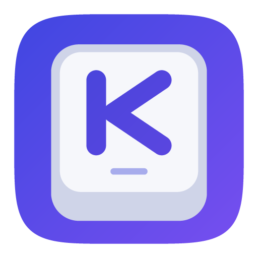
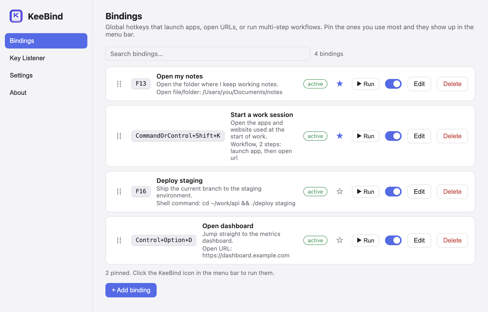
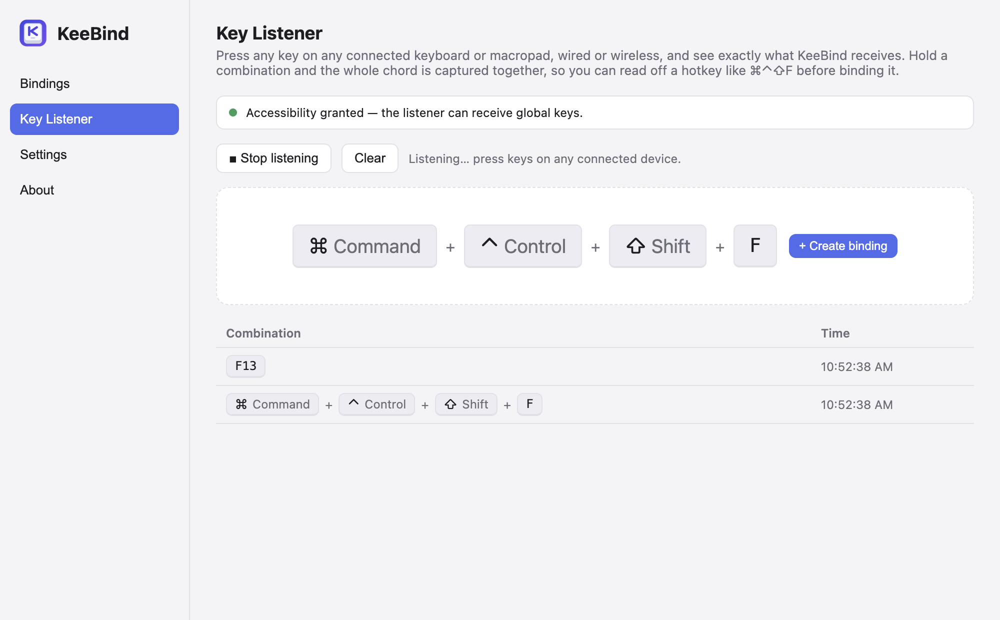
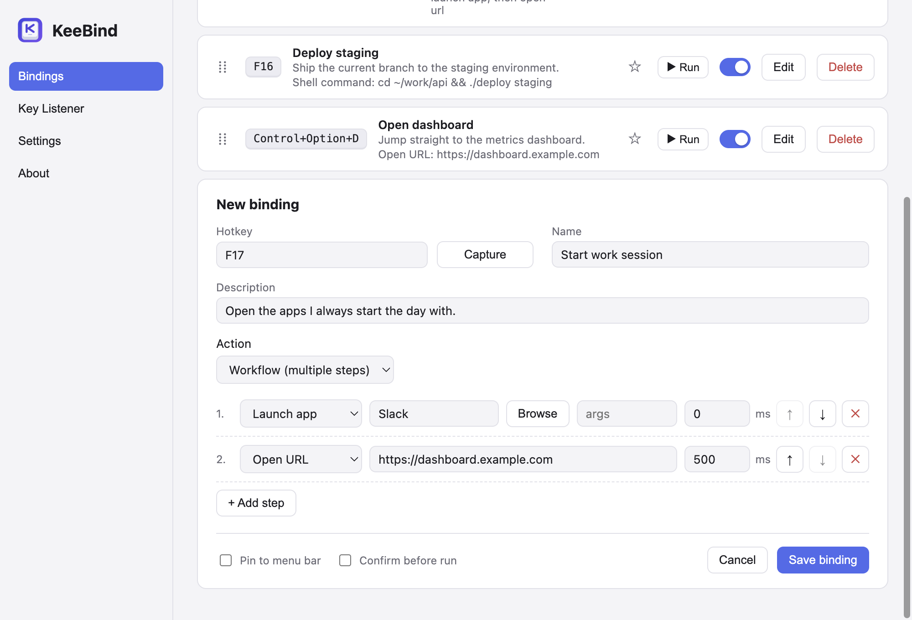
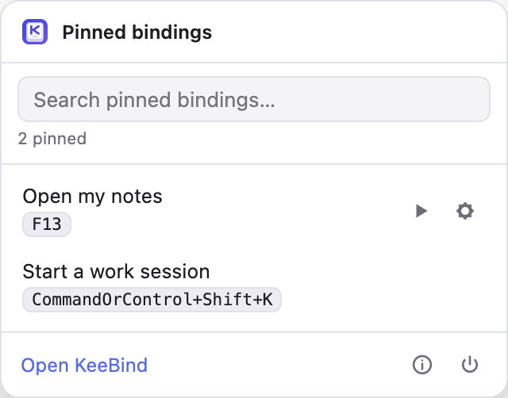
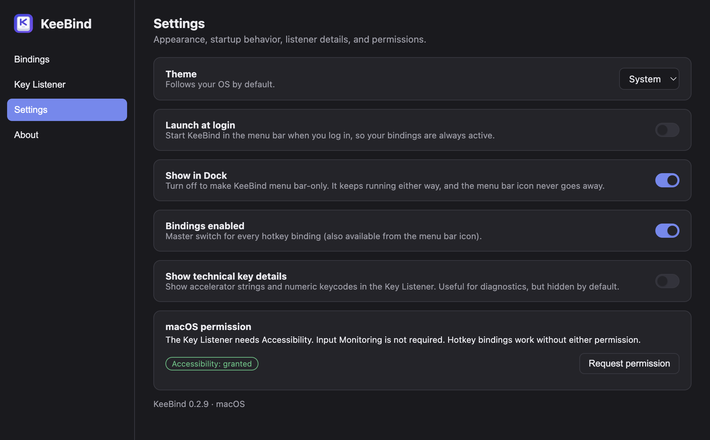

<div align="center">



# KeeBind

**A minimal keybinder and key listener for keyboards and macropads.**

Lives in the macOS menu bar and the Windows notification area — your hotkeys keep working with the window closed.


</div>



## ✨ What it does

- ⌨️ **Bind a key to anything** — launch an app, open a URL or folder, run a shell command, or chain several steps into a workflow with delays.
- 🔍 **Show what your keyboard actually sends** — whole chords, from any connected board including macropads, wired or wireless.
- ⚠️ **Warn before you shadow the OS** — every hotkey is checked against a per-OS database of system shortcuts (Spotlight, `Win`+`L`, PrtScn, the F13–F24 quirks).
- ⭐ **Pin favourites to the menu bar** — run them with the mouse, no hotkey needed.
- 🛡️ **Confirm risky bindings** — opt in per binding and KeeBind asks first, showing the exact action it is about to run.

## 📥 Install

Download the latest installer from [**Releases**](https://github.com/mtom2k/keebind/releases):

| Platform | File |
| --- | --- |
| 🍎 macOS (Apple silicon) | `KeeBind-<version>-arm64.dmg` |
| 🪟 Windows (x64) | `KeeBind Setup <version>.exe` |

Both platforms ship from the same version and the same commit. See the [platform notes](#-macos-notes) below for first-launch warnings.

## 🚀 Getting started

### 1. Find a key that's free

Open **Key Listener**, press **Start listening**, then press the key or combination you have in mind. KeeBind shows the whole chord and remembers what you pressed.

> 💡 `F13`–`F19` are the sweet spot: your OS doesn't use them, and most macropads can send them.



### 2. Turn it into a binding

Hit **+ Create binding** (or go to **Bindings → + Add binding**), then:

1. Set the **hotkey** — press **Capture** and hit the key, or type the accelerator.
2. Give it a **name** and an optional description.
3. Pick an **action**, or switch to **Workflow (multiple steps)** to run several in order.
4. **Save binding** — it's live immediately, system-wide.



| Action | What it does |
| --- | --- |
| **Launch app** | Opens an application, with optional arguments. |
| **Open URL** | Opens a link in your default browser. |
| **Open file/folder** | Opens a path with whatever app normally handles it. |
| **Shell command** | Runs a command (zsh on macOS, cmd on Windows). |
| **Workflow** | Runs any number of the above in order, with per-step delays. |

### 3. Pin the ones you use most ⭐

Click the star on a binding and it appears in the tray popover. Double-click a row to run it, or use the ▶ and ⚙ buttons that show on hover.

<p align="center">
  
</p>

### 4. Make it yours

**Settings** covers theme, launch at login, tray-only mode, the master switch for every binding, and macOS permissions.



## 🍎 macOS notes

- The **Key Listener needs Accessibility** — grant it with **Request permission** in Settings. Input Monitoring is *not* required, and hotkey bindings work without any permission at all.
- Builds are ad-hoc signed, so Gatekeeper warns on first open: **right-click → Open**.
- After an update, permissions must be granted again and System Settings will still show the old entry ticked. That is macOS tying a grant to the exact copy of the app. Settings detects it and offers **Clear old records**.
- When upgrading, **quit the running menu-bar copy first**. KeeBind is single-instance, so an older resident process otherwise stays the app you see.

## 🪟 Windows notes

- No privacy permission needed — start the Key Listener straight away.
- The installer is not code-signed yet, so SmartScreen may warn on first launch.
- Turn off **Show in taskbar** for notification-area-only use.

## 🛠️ Build from source

```bash
npm install
npm run dev          # run in development
npm run build:mac    # dmg + zip (ad-hoc signed, not notarized)
npm run build:win    # x64 NSIS installer (native or cross-built from macOS)
```

Node ≥ 20. The screenshots above are generated from the real UI with `npm run screenshots`.

## 📚 Documentation

| Doc | Contents |
| --- | --- |
| [PROJECT_STATE.md](docs/PROJECT_STATE.md) | What works today, what's verified, what's planned |
| [ARCHITECTURE.md](docs/ARCHITECTURE.md) | Module map, IPC contract, data flow |
| [HANDOFF.md](docs/HANDOFF.md) | How to pick up development (humans and LLMs) |
| [DECISIONS.md](docs/DECISIONS.md) | Why things are the way they are |

**These files are kept current as the code changes.** See [CLAUDE.md](CLAUDE.md) for the rule.
